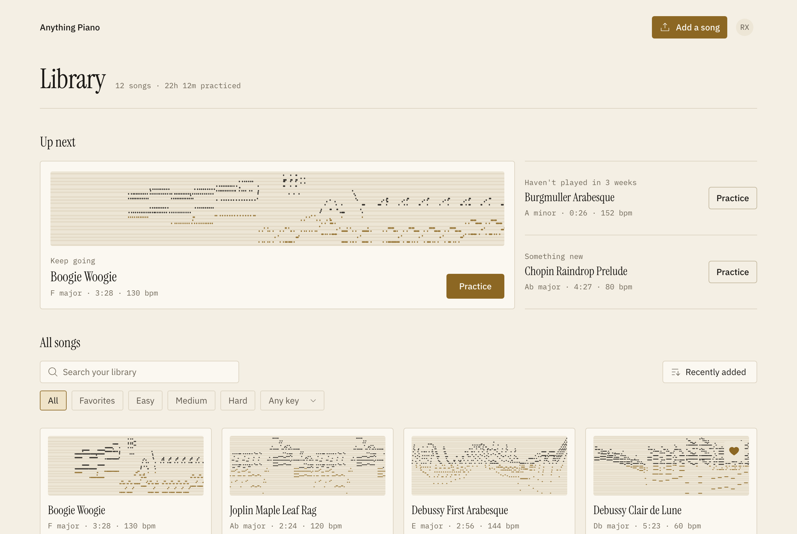
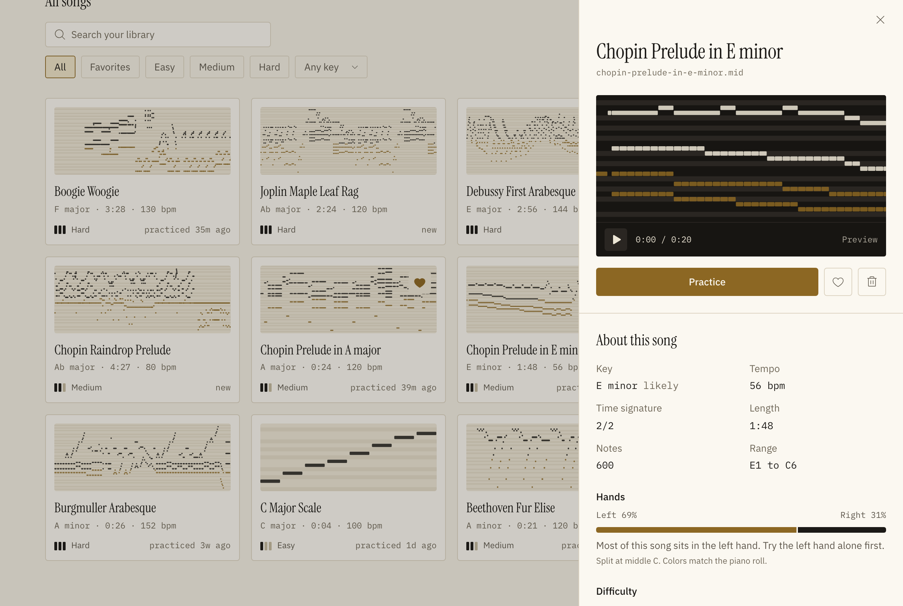
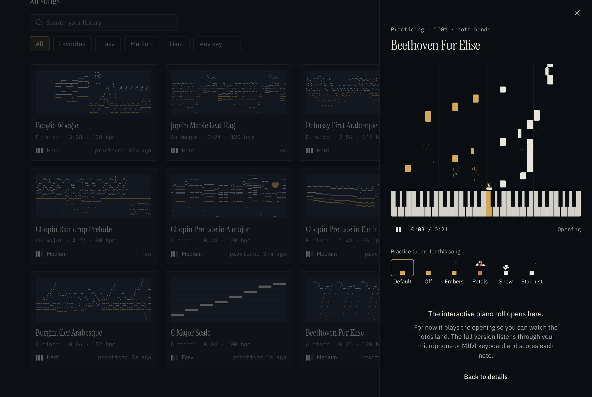
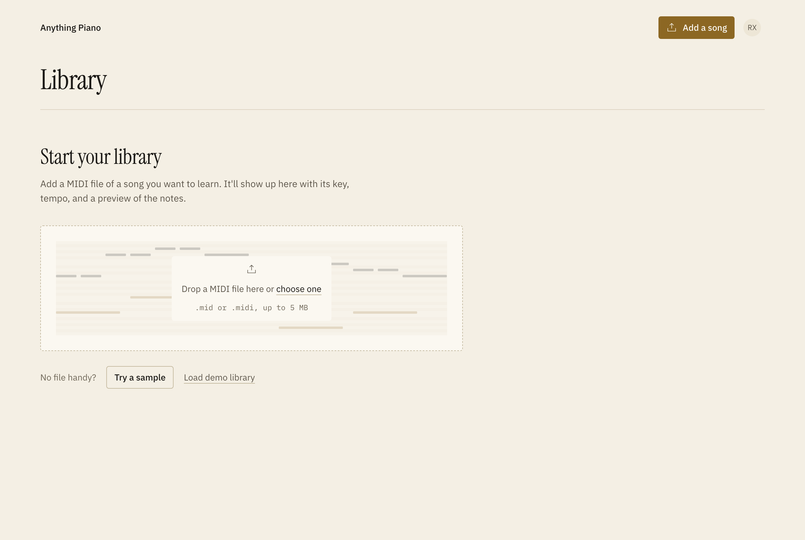
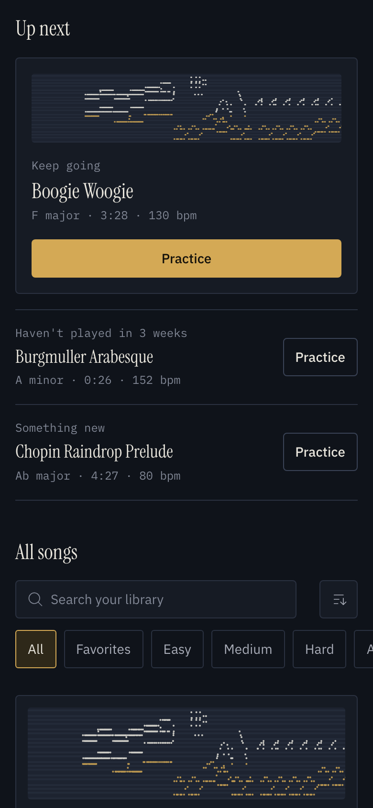
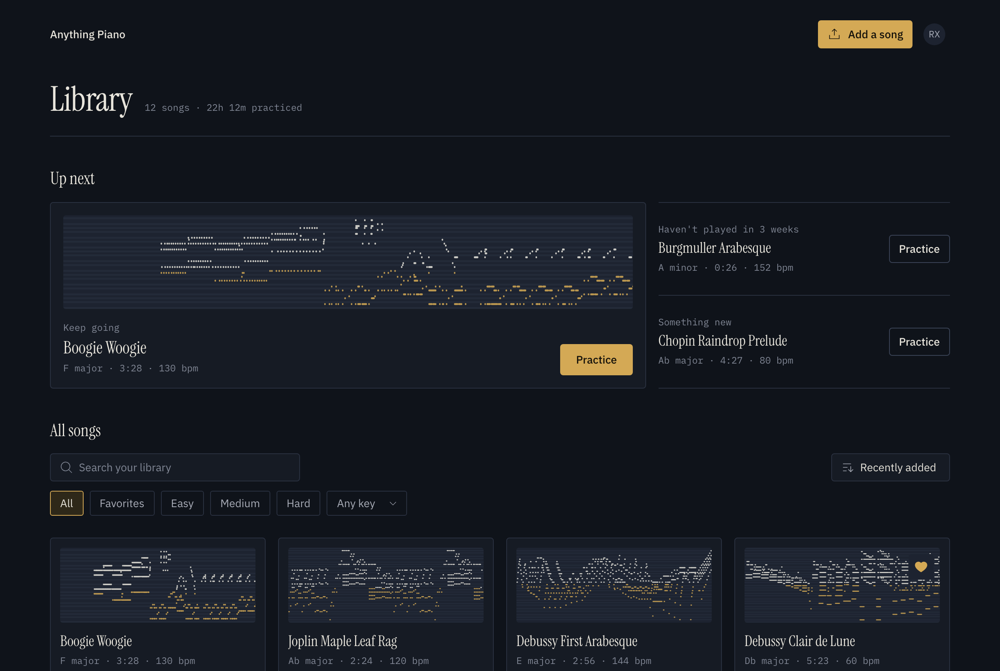

# Anything Piano: song library

A web version of the Anything Piano library: every song a learner has brought in, ready to practice. Uploading a `.mid` file stands in for the step Songscription's models do: "the user just transcribed a song".

**Live demo:** _link added after deploy_

Anything Piano has no fixed catalog; people bring any song. So the library *is* the catalog. An empty library is onboarding, and a full one is the reason to come back. Each feature maps to one step: add a song, practice it for the first time, come back tomorrow, build a habit.



| | |
|---|---|
|  |  |
|  |  |
|  | |

## What it does

| The learner asks | The library answers |
|---|---|
| Did my song work? | Drop files anywhere. A card shows "Reading notes…" while the file is parsed, then the song appears. Wrong file types, empty files, and network failures each get a plain explanation. Uploading a song that's already there opens it instead of adding a copy. |
| What do I do first? | The empty state is onboarding: drop a file, try a sample, or load a demo library with a few weeks of practice history. |
| Which song is which? | Every card shows a piano roll drawn from the song's real opening notes. Right hand in black ink, left hand in brass. Hover to hear 10 seconds on a real grand piano. |
| Can I play this? | Key, tempo, range, and difficulty are computed from the notes. The drawer adds which hand does the work ("Most of this song sits in the left hand. Try the left hand alone first.") and where the song gets busy, start to finish ("Busiest from 2:00 to 3:38"). |
| What should I practice today? | **Up next**: keep going with your latest song, revisit a favorite that's slipping, or start something new. |
| Where's that song? | Search that forgives accents and word order, difficulty and favorites chips, a key filter, and five sorts. Tested at 300 songs. |
| Does this transcription sound right? | One tap in the drawer. Every answer is labeled data for the model team. |
| How do I like to practice? | Library-wide defaults (speed, hands, practice theme) in the Settings menu, and per-song overrides in each song's drawer. |

**At 0, 3 and 300 songs.** At 0, the library is onboarding. With a few songs, Up next starts suggesting what to practice and small libraries get a nudge to add another. At 300, search, chips and sort keep it usable (tested with 300 mock songs).

**About practice.** The brief asks for a placeholder, so this isn't a practice experience: there's no scoring, no listening and no editing. The Practice button opens a 45-second preview of the song's opening as falling notes onto a keyboard. I built it last, as a stretch, to test one retention idea: personal practice themes (small particle effects as each note lands) as something people share and a natural Pro perk.

## How the data is stored

Supabase, on the same stack Play Anything runs (Next.js, Tailwind, Supabase). Two tables and one storage bucket. The full schema, with comments, is in [`supabase/schema.sql`](supabase/schema.sql).

**`songs`**: one row per song, with columns grouped by where they come from.

- **The file:** title, file name, storage path, size, and a SHA-256 `file_hash` with a unique index. The same file can't be added twice, which in production also means the same song is never transcribed twice on a GPU.
- **Parsed once from the MIDI on upload**, so the library can filter, sort, and draw 300 thumbnails without reading 300 files:
  - key and key confidence
  - tempo, time signature, and length
  - note count and range
  - share of notes in the right hand
  - `onsets_per_sec`, `avg_chord_size`, `difficulty_score`, and the easy, medium, or hard bucket
  - `density`, how busy each fortieth of the song is, drawn as the "where it gets hard" strip
  - `preview_notes`, the first 500 notes as `{p, t, d}`, drawn as the thumbnail
- **Learner data**, mocked since there's no auth: favorite, tags, practice count, last practiced, best accuracy.
- **Research:** `quality_rating` (right, some off, or unusable) and an optional note.
- **Per-song practice overrides:** speed, hands, and theme. Null means "use the library default", so changing a default reaches every song that was never customized.

**`events`**: append-only product analytics (`name`, `song_id`, `props jsonb`, `created_at`). It's indexed on `(name, created_at)` for funnel queries and on `song_id` for per-song joins. Logging is fire-and-forget, typed at every call site, never blocks the UI, and never stores search text. Only the query length and result count are kept.

**Storage:** the original `.mid` files live in the `midi` bucket, so a song can be re-parsed when the parser improves without asking the user to upload again.

**Querying:**
- The library loads with one indexed query. Search, filters, and sort then run in the browser, with no network round trips. At 311 songs, a keystroke repaints in about 33ms and a re-sort takes about 20ms.
- Writes send only the changed fields and read back only those. A favorite toggle's response is 64 bytes.
- The trigram, tag, and last-practiced indexes are there for when libraries outgrow a single fetch (see "What's next").

Key detection uses Krumhansl-Schmuckler key profiles. Difficulty counts how often the hands move, chord size and keyboard span, because raw notes per second rated a slow, chordal Chopin prelude as hard. The details and the known misses are in [`DECISIONS.md`](DECISIONS.md) #8 and #9.

## Questions this data answers

The founders named user research as a top challenge, so the data model is built to answer product questions directly.

**Which Up next slot drives the most practice?** Practice started from Up next carries its slot. A practice started in the drawer after opening an Up next song keeps the slot too.

```sql
select props->>'slot' as slot, count(*) as practice_starts
from events
where name = 'practice_started' and props ? 'slot'
group by 1
order by 2 desc;
```

**What share of upload attempts fail, and why, over the last 7 days?** Every upload attempt ends in exactly one of `song_added`, `duplicate_detected`, or `upload_failed`, so together they're the denominator.

```sql
with attempts as (
  select * from events
  where name in ('song_added', 'duplicate_detected', 'upload_failed')
    and props->>'source' = 'upload'
    and created_at > now() - interval '7 days'
)
select props->>'reason' as reason,
       count(*) as failures,
       round(100.0 * count(*) / (select count(*) from attempts), 1) as pct_of_attempts
from attempts
where name = 'upload_failed'
group by 1
order by 2 desc;
```

**How do learners rate transcriptions?** Read from the song rows, not the events, so re-rating a song doesn't count twice. Demo songs are excluded.

```sql
select s.quality_rating, count(*) as songs,
       round(100.0 * count(*) / sum(count(*)) over (), 1) as pct
from songs s
join events e on e.song_id = s.id and e.name = 'song_added' and e.props->>'source' = 'upload'
where s.quality_rating is not null
group by 1
order by 2 desc;
```

## Design and quality

- **Ivory and ebony:** warm paper, black ink, one brass accent, and a night-blue dark mode. The only real color comes from each song's own notes. Colors are design tokens, and Tailwind's palette is replaced by them, so an off-system color can't be written.
- **Every state is designed:** empty, loading, one song, many songs, no results, uploading, duplicate, each failure reason, and error. It's accessible from the keyboard, with WCAG AA contrast in both themes (checked by script), reduced motion respected, and 40px tap targets on phones.
- **Tested:** 32 Playwright end-to-end tests (`npm test`) and 33 Vitest unit tests (`npm run test:unit`). The tests create their own songs and clean up after themselves.

Every meaningful choice is in [`DECISIONS.md`](DECISIONS.md), with what else was considered and the metric that would show whether it was right.

## Run it

Requires Node 20+ and a free [Supabase](https://supabase.com) project.

```bash
npm install
cp .env.example .env.local        # then fill in the two values below
npm run dev                       # http://localhost:3000
```

1. In Supabase, open **SQL Editor**, paste [`supabase/schema.sql`](supabase/schema.sql), and run it. It creates the tables, indexes, the `midi` storage bucket, and open demo policies. It's safe to re-run.
   If the editor says the transaction is read-only, set **Run as** to `postgres`, or run `npx supabase db query --linked -f supabase/schema.sql`.
2. From **Project Settings → API**, copy the project URL and the anon (public) key into `.env.local`:

```
NEXT_PUBLIC_SUPABASE_URL=https://your-project.supabase.co
NEXT_PUBLIC_SUPABASE_ANON_KEY=your-anon-key
```

Without `.env.local` the app still builds and shows a setup notice instead of a blank page.

| Script | What it does |
|---|---|
| `npm run dev` / `build` / `lint` | The usual |
| `npm test` | 32 Playwright end-to-end tests against the running dev server. They create their own songs and clean up after themselves. |
| `npm run test:unit` | Unit tests for key detection, difficulty, search, and suggestions |
| `npm run inspect:samples` | Runs the MIDI parser over `public/samples` and prints what the library would show |
| `npm run check:contrast` | Checks every color pairing in both themes against WCAG AA |
| `npm run seed:300` | Adds 300 mock songs to test scale (`-- --remove` to take them out) |
| `npm run reset` | Empties the library: rows, files, and events |
| `npm run backfill:density` | Fills the `density` column for songs added before it existed |

## Taking it to iOS and Android

This is a web prototype of a mobile product, so it's built to move:
- **What carries over unchanged.** Key and difficulty scoring, the density profile, search and sort, Up next, and the Supabase client and row types are plain TypeScript in `src/lib`, with no React or browser dependencies. A React Native (Expo) app reuses them, the schema, the queries, and the unit tests as they are.
- **What gets rewritten.** Only the thin browser layer: canvases become react-native-skia, the drawer becomes a native bottom sheet, audio moves to a native player, and file hashing uses `expo-crypto`.
- **It already behaves like an app on phones.** The drawer is a bottom sheet you can swipe away, tap targets are 40px, buttons that appear on hover stay visible on touch screens, and the layout is tested at 375px.

## What's next

1. **Accounts and Pro.** Supabase Auth, a `user_id` on songs and events, and RLS policies of `auth.uid() = user_id` in place of the open demo ones. Then a Pro entitlement (for example RevenueCat on mobile, synced to a Supabase table) that gates things like practice themes and transcription minutes.
2. **A reason to come back tomorrow.** A visible streak, and a per-visit session id on events, so D1 and D7 retention can be measured per person, not just per song.
3. **Scale past a few hundred songs.** A small thumbnail column for the list, with the full notes loaded when the drawer opens, then keyset pagination and server-side search on the trigram index.
4. **A share sheet from TikTok and Reels.** Most songs people want to learn start as a clip, so the fastest path is straight from the clip into the library.
5. **Real practice data.** A `practice_sessions` table that replaces the mocked counters, with atomic writes. That gives real streaks, real accuracy trends, and a better difficulty model trained on how people actually play.
6. **Connect the library to arrangements.** Anything Piano already arranges a song at your level. The library could show which levels each song has, and suggest stepping up once your best accuracy at the current level passes 90%. That turns mastery into the next reason to open the app.

## Notes

- Built with Claude Code, as the brief allows. Every decision is in `DECISIONS.md`, and I'm happy to walk through any of it.
- Sample songs are public domain engravings from the [Mutopia Project](https://www.mutopiaproject.org). See [`public/samples/CREDITS.md`](public/samples/CREDITS.md).
